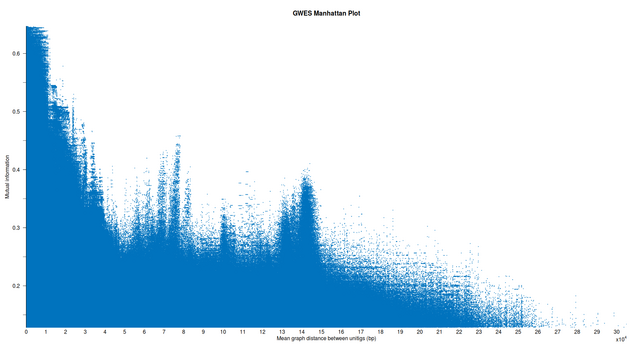
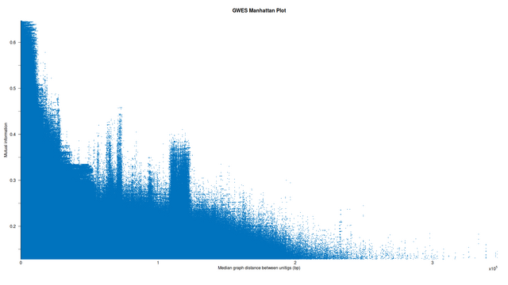
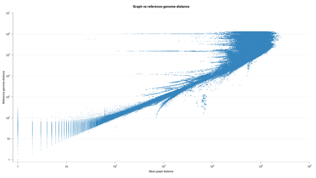
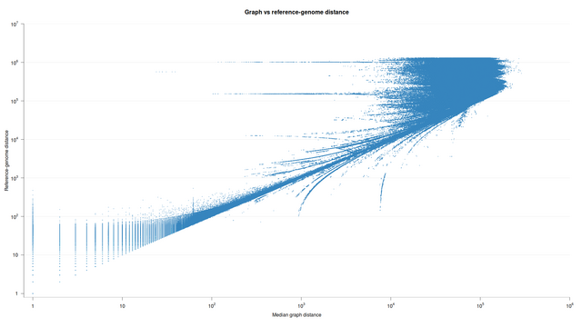

# PAN-GWES plotting scripts

This directory contains helper scripts for plotting **unitig_distance** results. They can be either run from the command
line or used with RStudio.

The plotting scripts include filters used in the [PAN-GWES paper](../README.md#cite) (see the "Filtering" subsection
under "Methods"):
- **Filter low-frequency unitig pairs**. Calculate a count corresponding to 5% of the SGGs in your dataset and pass it
  as `<connected_sgg_count_filter>` via CLI or set it in RStudio.
- **Filter by relative standard deviation**. This filter can be changed only by editing the script or when running it in
  RStudio. By default, the filter discards unitig pairs with relative standard deviation above 1.

## About the example plots

Example plots were drawn from results obtained by running the
[PAN-GWES pipeline](../examples/README.md#running-the-pan-gwes-pipeline) on 375 **Enterococcus faecalis** assemblies
from the [EFC collection](../test_data/README.md#efc-dataset).

## GWES Manhattan plot (gwes_plot.r)

Draw a GWES Manhattan plot from **unitig_distance** results.

Usage:

```
Rscript gwes_plot.r <unitig_distance_results_file> \
                    <output_plot_png> \
                    <connected_sgg_count_filter> \
                    <draw_median_distance>
```

Example:

```
Rscript gwes_plot.r efc_k61.ud_0_based \
                    efc_k61_gwes_plot.png \
                    19 \
                    0
```

Setting `<draw_median_distance>` to `1` plots median shortest-path graph distances instead of mean distances.

Example plots:

- [GWES Manhattan plot - mean distance](../examples/plots/efc_k61_gwes_plot_mean_distance.png)

  [](../examples/plots/efc_k61_gwes_plot_mean_distance.png)

- [GWES Manhattan plot - median distance](../examples/plots/efc_k61_gwes_plot_median_distance.png)

  [](../examples/plots/efc_k61_gwes_plot_median_distance.png)

## Map unitigs from unitig_distance results to reference-genome positions (map_unitigs_to_reference.pl)

**Requires [BWA-MEM](https://github.com/lh3/bwa).**

The mapping script runs **BWA-MEM** on the unitigs appearing in the **unitig_distance** results and retains only unitig
pairs for which both unitigs pass the mapping filters.

The script applies conservative filters: it discards unmapped segments and secondary or supplementary alignments,
requires ungapped CIGAR strings and exact matches, requires a mapping quality of at least 30, etc. These can be adjusted
in the script, although this requires familiarity with the SAM format
(see [SAMv1.pdf](https://samtools.github.io/hts-specs/SAMv1.pdf) and
[SAMtags.pdf](https://samtools.github.io/hts-specs/SAMtags.pdf)) and basic Perl.

Usage:

```
perl map_unitigs_to_reference.pl <unitigs_file> \
                                 <unitig_distance_results_file> \
                                 <n_unitig_distance_rows> \
                                 <mapped_unitig_distance_results_output_file> \
                                 "<bwa mem command>"
```

Example:

```
# Remember to index the reference-genome file first.
bwa index reference.fasta

perl map_unitigs_to_reference.pl cdbg_k61.unitigs \
                                 cdbg_k61.ud_0_based \
                                 10000000 \
                                 cdbg_k61.ud_0_based_mapped \
                                 "bwa mem -t 8 -k 11 -r 1.0 reference.fasta"
```

BWA-MEM can use a lot of memory, so limiting the number of rows read from the **unitig_distance** results is recommended.

The script detects whether the output uses 0-based or 1-based indices from the filename suffix `.ud_0_based` or
`.ud_1_based`.

The mapped output contains the original **unitig_distance** columns followed by the two reference-genome positions where
the unitigs map and the two unitig sequences. Use it with
[graph_vs_reference_distance_scatter_plot.r](#graph-vs-reference-genome-distance-scatter-plot-graph_vs_reference_distance_scatter_plotr)
for comparing graph distances against reference-genome distances.

## Graph vs reference-genome distance scatter plot (graph_vs_reference_distance_scatter_plot.r)

Draw a scatter plot comparing **unitig_distance** graph distances against reference-genome distances for the same
unitig pairs.

The input must first be produced with
[map_unitigs_to_reference.pl](#map-unitigs-from-unitig_distance-results-to-reference-genome-positions-map_unitigs_to_referencepl),
which maps the unitigs in the **unitig_distance** results to reference-genome positions. The plotted reference-genome
distance is calculated from the reference-genome positions where each unitig pair maps (`<reference_length>` is used to
calculate the shortest circular distance between mapped positions).

Usage:

```
Rscript graph_vs_reference_distance_scatter_plot.r <mapped_unitig_distance_results_file> \
                                                   <output_plot_png> \
                                                   <connected_sgg_count_filter> \
                                                   <reference_length> \
                                                   <draw_median_distance>
```

Example:

```
Rscript graph_vs_reference_distance_scatter_plot.r efc_k61.ud_0_based_mapped \
                                                   efc_k61_graph_vs_reference_genome_distance_plot.png \
                                                   19 \
                                                   2619941 \
                                                   0
```

Setting `<draw_median_distance>` to `1` plots median graph distances instead of mean graph distances.

Example plots:

- [Mean graph distance vs reference-genome distance plot](../examples/plots/efc_k61_mean_graph_distance_vs_reference_genome_distance_plot.png)

  [](../examples/plots/efc_k61_mean_graph_distance_vs_reference_genome_distance_plot.png)

- [Median graph distance vs reference-genome distance plot](../examples/plots/efc_k61_median_graph_distance_vs_reference_genome_distance_plot.png)

  [](../examples/plots/efc_k61_median_graph_distance_vs_reference_genome_distance_plot.png)
